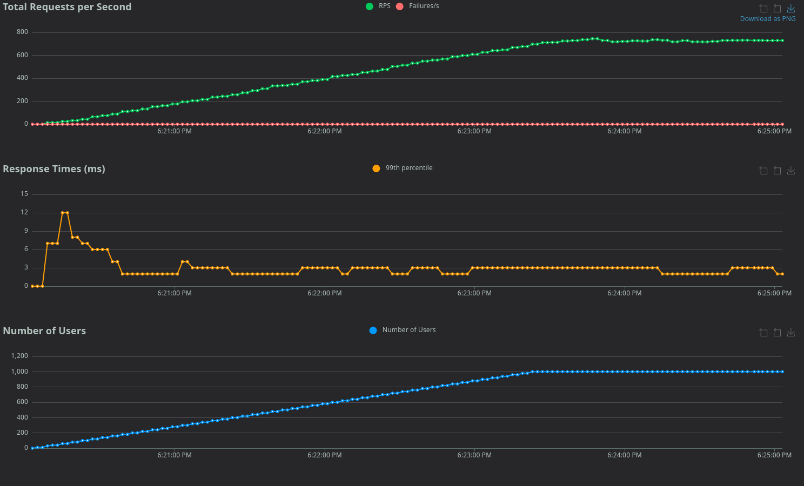

## Assumptions
* Security is out of scope. It is assumed that the application is running in a secure environment behind API gateway or proxy like Envoy.
* Table management is out of scope. Application support arbitrary number of tables, and they don't have to be created beforehand.
In microservices architecture, table management can be handled by a separate service.
* Menu management is out of scope. Item name is added by the staff during creation request.
* Item preparation time is calculated based on the current time plus random delta.
* Pagination has not been implemented due to requirements to show all items.

## Stack
* Rust
* Axum
* Sqlx
* Postgres

## Running the application
Application is containerized. To run the application, execute the following command:
```shell
docker compose up
````
When application is running, it is available at port 3000.

## Project structure
```
├── benchmark # Benchmark script
│   └── ...
├── migrations # Database migrations scripts
│   └── ...
├── src
│   ├── application # Application layer orchestrating business logic
│   │   └── ...
│   ├── domain # Domain objects and traits
│   │   └── ...
│   ├── infrastructure # Outgoing ports, database communication
│   │   └── ...
│   ├── server # Middleware and core server not related to business logic
│   │   └── ...            
│   └── web # Incoming ports, HTTP communication  
│       └── ...           
├── tests # Test files
│   └── ...
├── .env # Environment variables
├── docker-compose.yml # Stack configuration
└── ...
```
## Benchmark
Application has been benchmarked in following scenario:
* Waiter approaches the table and queries current items for table.
* If there are no items, waiter creates between 1 and 5 items.
* Otherwise waiter can create between 1 and 5 items or delete existing item.

System specification:
* CPU: AMD Ryzen 9 5950X
* Memory: 64 GB

Each container has been allocated 2 cores and 4GB of memory.

Parameters:
* Total users: 1000
* Ramp rate: 5 users per second
* Number of tables: 5000
* Duration: 5 minutes
* Total requests: 144 319
* Peak request per second: 744



## Endpoints
### Create item
Adds one or more items to the table.
* Method: POST
* Path: /tables/:tableId/items
#### Request Body:
```json
{
  "items": [
    {
      "name": "Pierogi"
    }
  ]
}
```
#### Response Body:
```json
{
  "items": [
    {
      "id": "01935d89-22d0-7010-81fe-1bd3df302542",
      "table_id": 0,
      "name": "Pierogi",
      "preparation_time": "2024-11-24T09:44:49.720285Z"
    }
  ]
}
```
Where `preparation_time` is the time when the item is going to be ready for serving.

### Get items
Returns all items for the table.
* Method: GET
* Path: /tables/:tableId/items
* Response Body:
```json
{
  "items": [
    {
      "id": "01935d89-22d0-7010-81fe-1bd3df302542",
      "table_id": 0,
      "name": "Pierogi",
      "preparation_time": "2024-11-24T09:44:49.720285Z"
    },
    {
      "id": "01935d8f-d241-7c22-b619-7269b8d00d9e",
      "table_id": 0,
      "name": "Pierogi",
      "preparation_time": "2024-11-24T09:50:34.849416Z"
    }
  ]
}
```
Where `preparation_time` is the time when the item is going to be ready for serving.

### Get item
Returns a single item.
* Method: GET
* Path: /tables/:tableId/items/:itemId
#### Response Body:
```json
{
  "id": "01935d89-22d0-7010-81fe-1bd3df302542",
  "table_id": 0,
  "name": "Pierogi",
  "preparation_time": "2024-11-24T09:44:49.720285Z"
}
```
Where `preparation_time` is the time when the item is going to be ready for serving.

### Delete item
Deletes an item.
* Method: DELETE
* Path: /tables/:tableId/items/:itemId
#### Response Body: NO CONTENT